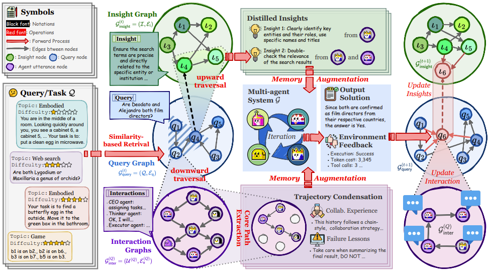

Our method, G-Memory, empowers multi-agent systems with a hierarchical memory architecture that continuously evolves through interaction. Inspired by organizational memory theory, G-Memory captures generalizable insights and agent-specific collaboration trajectories across tasks using a structured graph-based design. When a new task arrives, it retrieves relevant past experiences and distilled knowledge to inform agent behavior and coordination. As agents complete tasks, G-Memory updates its memory hierarchy with new interactions, enabling teams to adapt and improve over time.
